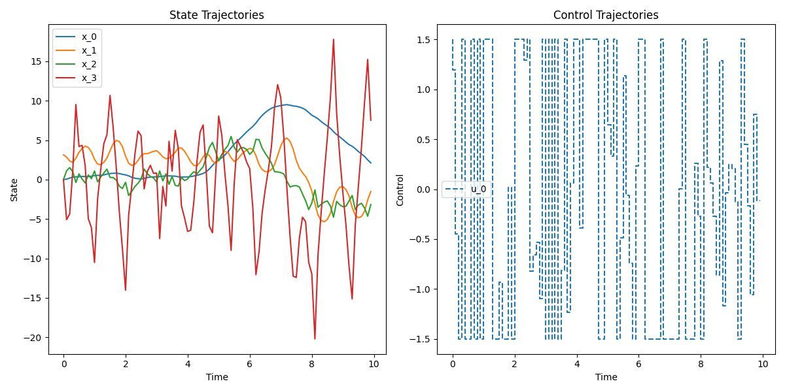
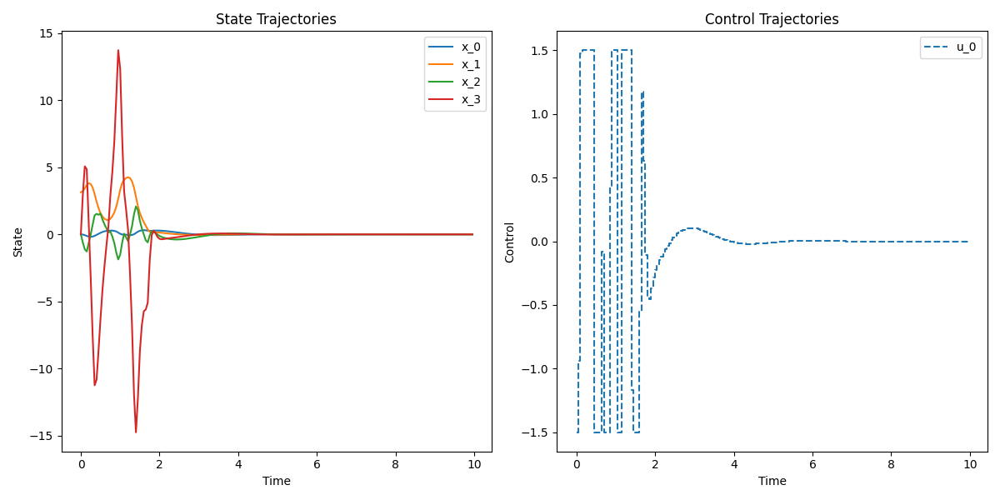

# Model Predictive Control

- control sampling time이 50ms (20hz)보다 커지면 제어가 안 된다.
- Solver를 직접 개발하고 최적화해야 한다. solver에 의존하게 되면 진정한 의미의 최적화를 할 수 없다.

T = 0.1

{: .align-center width="300" height="150"}

T = 0.05

{: .align-center width="300" height="150"}

- 연산 시간이 오래 걸린다... 초반에 1초까지 걸린다. 나중에는 현저하게 줄어든다.

$$
\begin{align*}
  & \underset{u}{\mathrm{minimize}} \;\;\;
  \sum^{9}_{i=0} \left[
  \begin{bmatrix}
    x_1(i) \\
    x_2(i) \\
    x_3(i) \\
    x_4(i) \\
  \end{bmatrix}^T
  \begin{bmatrix}
    1 & 0 & 0 & 0 \\
    0 & 10 & 0 & 0 \\
    0 & 0 & 10^{-4} & 0 \\
    0 & 0 & 0 & 10^{-4} \\
  \end{bmatrix}
  \begin{bmatrix}
    x_1(i) \\
    x_2(i) \\
    x_3(i) \\
    x_4(i) \\
  \end{bmatrix} + 0.05 u^T(i) u(i) \right] \\
  & \mathrm{subject \; to} \;\;\;
\end{align*}
$$

$$
0 \leq
\begin{bmatrix}
  g_1(0) \\
  g_2(0) \\
  g_3(0) \\
  g_4(0) \\
  g_1(1) \\
  \vdots \\
  g_4(8) \\
  g_1(9) \\
  g_2(9) \\
  g_3(9) \\
  g_4(9) \\
\end{bmatrix}
\leq 0, \;\;\;
\begin{bmatrix}
  x_1(0) \\
  x_2(0) \\
  x_3(0) \\
  x_4(0) \\
  -0.36 \\
  \vdots \\
  -\infty \\
  -0.36 \\
  -\infty \\
  -\infty \\
  -\infty \\
  -1 \\
  -1 \\
  \vdots \\
  -1 \\
\end{bmatrix}
\leq
\begin{bmatrix}
  x_1(0) \\
  x_2(0) \\
  x_3(0) \\
  x_4(0) \\
  x_1(1) \\
  \vdots \\
  x_4(9) \\
  x_1(10) \\
  x_2(10) \\
  x_3(10) \\
  x_4(10) \\
  u(0) \\
  u(1) \\
  \vdots \\
  u(9) \\
\end{bmatrix}
\leq
\begin{bmatrix}
  x_1(0) \\
  x_2(0) \\
  x_3(0) \\
  x_4(0) \\
  0.36 \\
  \vdots \\
  \infty \\
  0.36 \\
  \infty \\
  \infty \\
  \infty \\
  1 \\
  1 \\
  \vdots \\
  1 \\
\end{bmatrix}
$$

# Question

- 일반적으로 알고리즘의 성능을 수렴성을 가지고 평가한다. 경로 생성 알고리즘은 어떤 정량적인 기준으로 평가할 수 있을까? 좋은 경로 생성 알고리즘을 어떻게 정량적으로 묘사할 수 있을까?
- Terminal cost의 weight matrix가 만족해야 할 조건
- 변하는 목표 상태를 어떻게 다룰 것인가?
- 목표 입력을 어떻게 설정할 것인가?
- 중앙선을 추종하는 문제에서 constraint가 필요할까?
- 제어기를 분석할 때 어떤 걸 봐야 하는가? - 시간에 따른 상태 변화, 시간에 따른 입력의 변수

# 다음주까지 해야 할 일

- dynamic model 구하기
- 중앙선을 얻을 수 있는 방법 마련하기 (그 전까지 slam...)
- python, numpy로 중앙선 추종 mpc 작성하기
